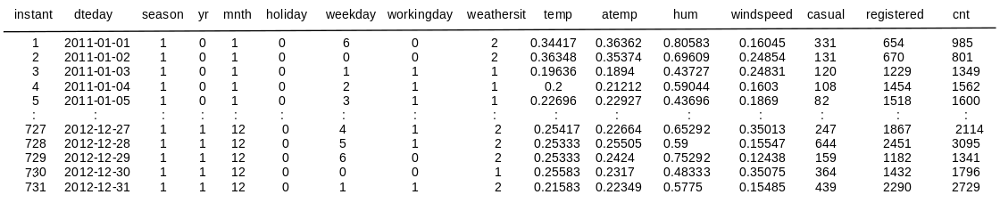
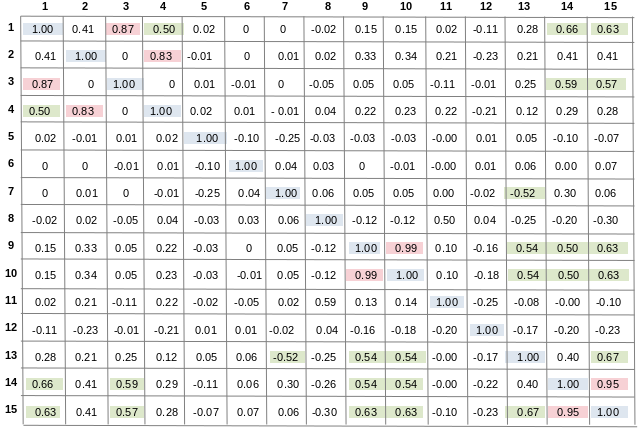
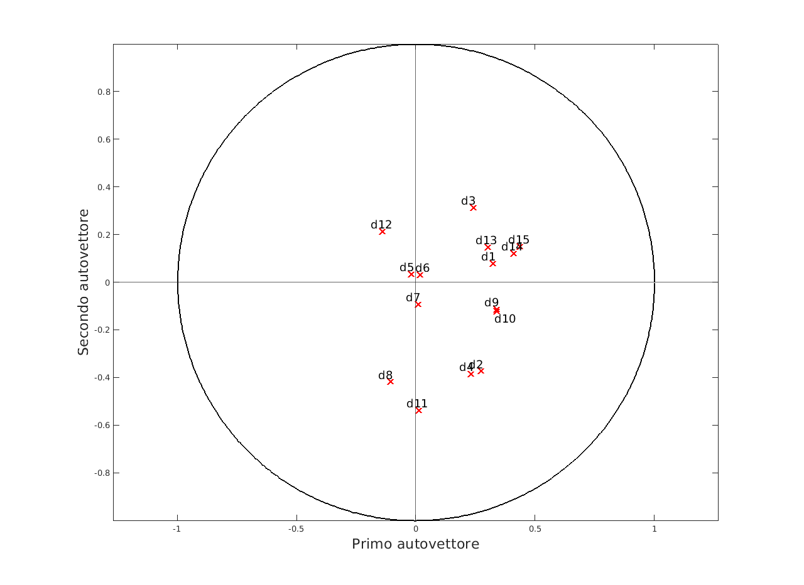
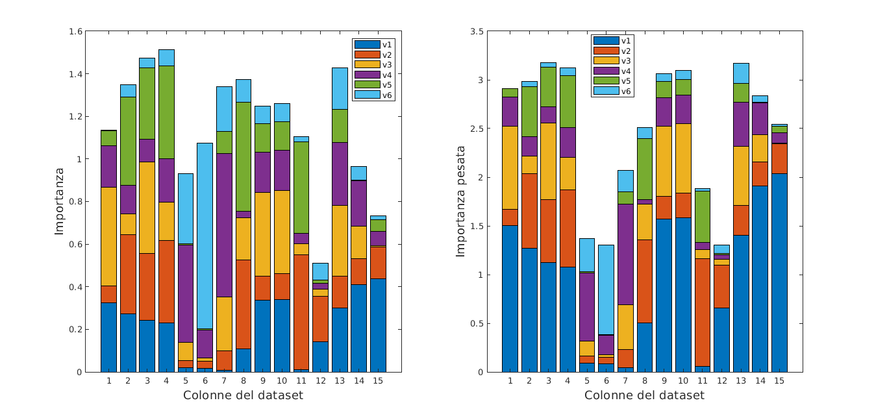
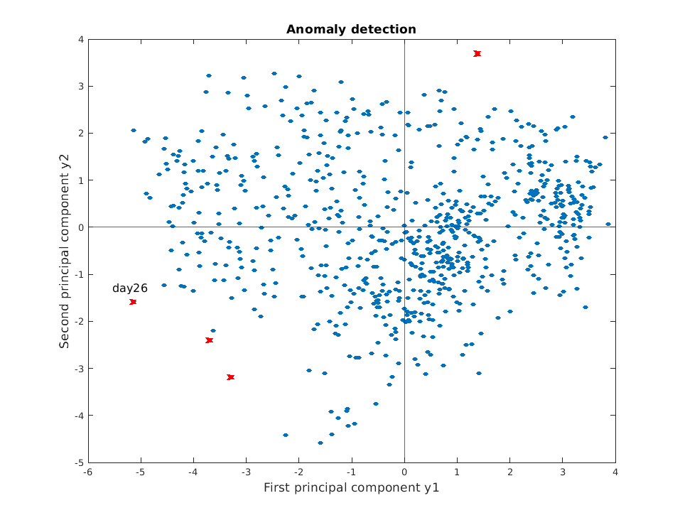
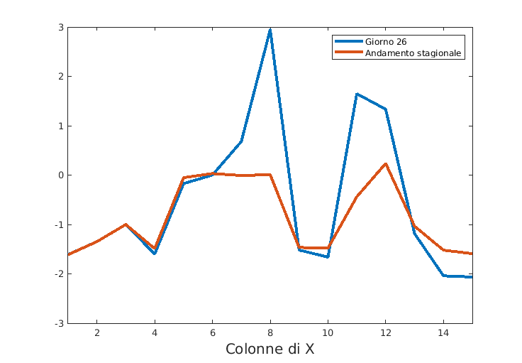

# Principal Component Analysis on a real dataset.

Data Mining course 2021-2022.  
Masters' Degree in Applied Mathematics, Sapienza University of Rome.  
Exam date: July 19th 2022.

Joint work with <em>Emanuele Ferrelli</em> (email: [e.ferrelli@hotmail.com](mailto:e.ferrelli#hotmail.com)).

 

---

Principal component analysis is a data 
simplification technique that works by applying 
a linear transformation to the dataset features.
Its aim is data dimensionality reduction, 
minimizing as much as possible the loss of 
information.

In this project we analyse some data [^1] on bike 
rental recorded in 2011-2012 by am American company.

# Dataset
The data that we analyse was downloaded at the 
following [link](https://archive.ics.uci.edu/ml/datasets/Bike+Sharing+Dataset).  
The dataset records the total daily number of 
bikes rented by the American service "capital 
bikeshares" for a total 731 days. 
Along with daily shares, many other information 
are taken into account: 

Here is a brief description of the features names:  

	- instant: record index
	- dteday : date
	- season : season (1:springer, 2:summer, 3:fall, 4:winter)
	- yr : year (0: 2011, 1:2012)
	- mnth : month ( 1 to 12)
	- hr : hour (0 to 23)
	- holiday : weather day is holiday or not (extracted from http://dchr.dc.gov/page/holiday-schedule)
	- weekday : day of the week
	- workingday : if day is neither weekend nor holiday is 1, otherwise is 0.
	- weathersit : 
		- 1: Clear, Few clouds, Partly cloudy, Partly cloudy
		- 2: Mist + Cloudy, Mist + Broken clouds, Mist + Few clouds, Mist
		- 3: Light Snow, Light Rain + Thunderstorm + Scattered clouds, Light Rain + Scattered clouds
		- 4: Heavy Rain + Ice Pallets + Thunderstorm + Mist, Snow + Fog
	- temp : Normalized temperature in Celsius. The values are divided to 41 (max)
	- atemp: Normalized feeling temperature in Celsius. The values are divided to 50 (max)
	- hum: Normalized humidity. The values are divided to 100 (max)
	- windspeed: Normalized wind speed. The values are divided to 67 (max)
	- casual: count of casual users
	- registered: count of registered users
	- cnt: count of total rental bikes including both casual and registered

We discarded column 2 as it is somehow redundant 
and standardized the dataset columnwise.

# Correlation analysis
First of all we studied the correlation among the 
features. Have a look at the next picture for the 
a correlation matrix. 

A high positive correlation 
in clearly visible between columns 14 and 15 and 
between columns 9 and 10. On the contrary columns 
8 and 15 show a negative correlation.

This confirms how bad weatear discourages bike 
sharing.
The correlation coefficient $r(15,3)$ is also 
positive showing that bike rental had a positive 
trend during 2011-2012.

# PCA Analysis
Given a matrix of data X, finding the first p 
principal component means finding p direction 
such that 

$Var(Xa_1)= max(Var(Xa) \text{ with } a \in R^p \text{ and } ||a||_2 = 1)$ 

$Var(Xa_j)= max(Var(Xa) \text{ with } a \in R^p \text{ and } ||a||_2 = 1)$
$\text{ such that } Cov(Xa_i,Xa_j)=0 \text{ , for all } $.

If we standardize the columns of X (i.e. column $x_i$
becomes $z_i = \frac{x_i - mean(x_i)}{dev\_st(x_i)}$, $\forall i$) it is 
possible to prove that the best direction $a_1,..,a_p$ 
(i.e. directions that satisfy the above formulas) are the first $p$ 
eigenvectors of the correlation matrix $R$ of our data.
$y_1,..,y_p$ are called the first $p$ principal components.

In our case, the next picture reports the 
eigenvalues of the correlation matrix $R$.

As we can see, 90% of the total variance in 
represented by the first 6 eigenvalues, while the 
first 5 are enough to explain 80% of the total
 variance.

## Analysis of $y_1$ and $y_2$

The first two eigenvectors are: 
$j$

$v_1 = [0.32, 0.27, 0.24, 0.23, -0.02, 0.02, 0.01, -0.11, 0.34, 0.34, 0.01, 0.14, 0.30, 0.41, 0.44]$

$v_2 = [0.08, -0.37, 0.31, -0.38, 0.03, 0.03, -0.09, -0.42, -0.11, -0.12, -0.54, 0.21, 0.15, 0.12, 0.15]$

These two vectors provide a criterium to know how 
each feature "weights" for the first two principal 
components. The next picture explains this concept 
better.

None of the 15 feature is essentially more 
important than the others.

## Analysis of $y_1,..y_6$

## Anomaly detection

  

[^1]: Hadi Fanaee-T and Joao Gama.   Event labeling combining ensemble detectors and background knowledge.  Progress in Artificial Intelligence, pages 1–15, 2013.

