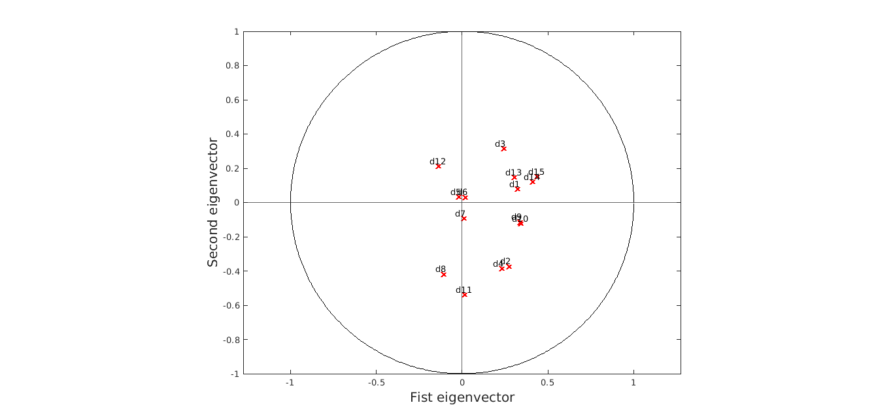
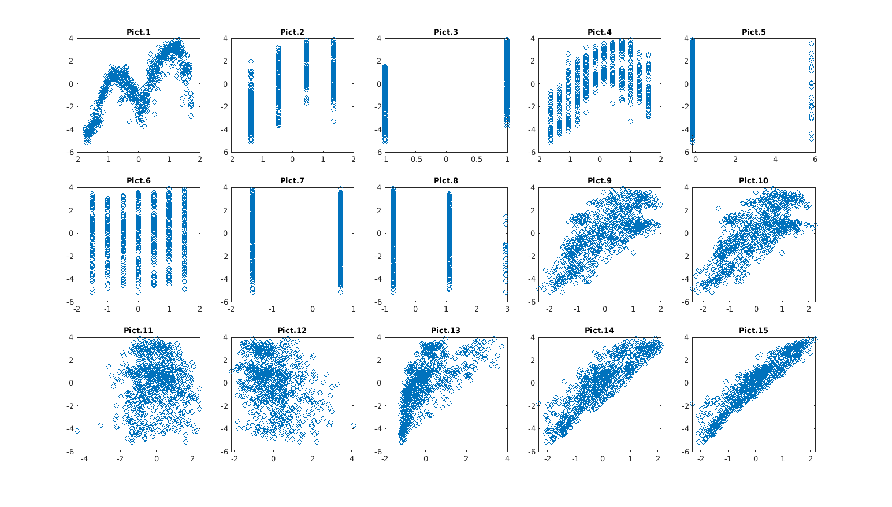

# Principal Component Analysis on a real dataset.

Data Mining course 2021-2022.  
Masters' Degree in Applied Mathematics, Sapienza University of Rome.  
Exam date: July 19th 2022.

Joint work with <em>Emanuele Ferrelli</em> (email: [e.ferrelli@hotmail.com](mailto:e.ferrelli#hotmail.com)).

 

---

Principal component analysis is a data 
simplification technique that works by applying 
a linear transformation to the dataset features.
Its aim is data dimensionality reduction, 
minimizing the loss of 
information as much as possible.

# Dataset overview
In this project we analysed some data [^1] on bike 
rental recorded in 2011-2012 by am american company (<em>Capital 
Bikeshares</em>) downloaded from the 
following [link](https://archive.ics.uci.edu/ml/datasets/Bike+Sharing+Dataset).  

The dataset records the total daily number of 
bikes rented by the american servicefor a total 731 days. 
Along with daily shares, many other information 
are taken into account: 

<figcaption align = "center"><b>Dataset</b></figcaption>

Here is a brief description of the features names:  

	- instant: record index
	- dteday : date
	- season : season (1:springer, 2:summer, 3:fall, 4:winter)
	- yr : year (0: 2011, 1:2012)
	- mnth : month ( 1 to 12)
	- hr : hour (0 to 23)
	- holiday : weather day is holiday or not (extracted from http://dchr.dc.gov/page/holiday-schedule)
	- weekday : day of the week
	- workingday : if day is neither weekend nor holiday is 1, otherwise is 0.
	- weathersit : 
		- 1: Clear, Few clouds, Partly cloudy, Partly cloudy
		- 2: Mist + Cloudy, Mist + Broken clouds, Mist + Few clouds, Mist
		- 3: Light Snow, Light Rain + Thunderstorm + Scattered clouds, Light Rain + Scattered clouds
		- 4: Heavy Rain + Ice Pallets + Thunderstorm + Mist, Snow + Fog
	- temp : Normalized temperature in Celsius. The values are divided to 41 (max)
	- atemp: Normalized feeling temperature in Celsius. The values are divided to 50 (max)
	- hum: Normalized humidity. The values are divided to 100 (max)
	- windspeed: Normalized wind speed. The values are divided to 67 (max)
	- casual: count of casual users
	- registered: count of registered users
	- cnt: count of total rental bikes including both casual and registered

 

We discarded column 2 as it is redundant 
and standardized the dataset columnwise.

 

# Correlation analysis
First of all we studied the correlation among the 
features. Have a look at the next picture for the 
a correlation matrix. 

A high positive correlation 
in clearly visible between columns 14 and 15 and 
between columns 9 and 10. On the contrary columns 
8 and 15 show a negative correlation.

This confirms how bad weatear discourages bike 
sharing.
The correlation coefficient $r(15,3)$ is also 
positive, showing that bike rental had a positive 
trend during 2011-2012.

# PCA Analysis

Given a matrix of data X, finding the first $p$ 
principal components means finding $p$ directions $a_1,..,a_p$ 
such that:  

$$Var(Xa_1)= max(Var(Xa) \text{ with } a \in R^p \text{ and } ||a||_2 = 1),$$ 

$$Var(Xa_j)= max(Var(Xa) \text{ with } a \in R^p \text{ and } ||a||_2 = 1)$$ 
$$\text{ such that } Cov(Xa_i,Xa_j)=0 \text{, for all } i < j \text{ and } j: 2..p$$

If we standardize the columns of X (i.e. column $x_i$
becomes $z_i = \frac{x_i - mean(x_i)}{dev\_st(x_i)}$, $\forall i$) it is 
possible to prove that the "best" directions $a_1,..,a_p$ 
(i.e. directions that satisfy the above formulas) are the first $p$ 
eigenvectors $v_1,..,v_p$ of the correlation matrix $R$ of our data. 
$y_1 = Xv_1,...,y_p=Xv_p$ are called the first $p$ principal components. 
Note that $Var(Xv_j) = v_j^TRv_j = \lambda_j$, the $j$-th 
eigenvalue of the matrix R.

In our case, the next picture reports the 
eigenvalues of the correlation matrix $R$.

As we can see, 90% of the total variance in 
represented by the first 6 eigenvalues, while the 
first 5 are enough to explain 80% of the total
 variance.

## Analysis of $y_1$ and $y_2$
The first two eigenvectors of $R$ are: 

$v_1 = [0.32, 0.27, 0.24, 0.23, -0.02, 0.02, 0.01, -0.11, 0.34, 0.34, 0.01, 0.14, 0.30, 0.41, 0.44]$

$v_2 = [0.08, -0.37, 0.31, -0.38, 0.03, 0.03, -0.09, -0.42, -0.11, -0.12, -0.54, 0.21, 0.15, 0.12, 0.15]$

These two vectors provide a criterium to establish how 
each feature counts for the first two principal 
components. The next picture explains this concept 
better.

Here, each column $d_j$ of our dataset is represented as 
a point in $\mathbb{R}^2$ given by $(v_1(j),v_2(j))$. 
Points that lay near the unit circle and along one of the 
two bisectors are considered as very significant for
$y_1$ and $y_2$.
The previous picture shows that columns $d_3,d_2,d_4$ are the 
ones that count the most for both $y_1$ and $y_2$ at the
 same time. 
$d_11$ only affects $y_2$, while $d_9$ and $d_10$ mostly count
for $y_1$. Finally, $d_5,d_6,d_7$ are more or less irrelevant. 

Another way to study the feature importance for the first two
principal components is the following. We know from the theory that $\forall i,k=1,...,p$

$$r(y_i,d_k) = \frac{cov(y_i,d_k)}{\sqrt{var(y_i)var(d_k)}} = v_{i,k} \sqrt{\lambda_i}$$
We can therefore study the vectors $r_i = [r(y_i,d_1),..,r(y_i,d_p)] = \sqrt{\lambda_i}v_i$
as it is done in the next picture:

This confirms the relation $r_i = \sqrt{\lambda_i}v_i$ for all $i$ and 
tells us how each feature affects $y_1$ and $y_2$ weighting the importance
by $\lambda_1$ and $\lambda_2$. 

## Analysis of $y_1,..y_6$

As we have seen before, the first two eigenvalues alone only 
explain 40% of the total variance of the data. Therefore it can
be significan to study $y_1,...,y_6$ together.  
The next picture shows on the left the cumulated relevance of
each feature for $y_1,...,y_6$. On the right this relevance is
weighted by the eigenvalues $\lambda_1,...,\lambda_6$.

More on details, this (simple) relevance is definded as

$$R(d_j) = \sum_{i=1}^{6}|v_i(j)|$$
 
while the weighted relevance is given by: 

$$R_w(d_j)= \sum_{i=1}^{6}\lambda_i|v_i(j)|$$

It is fundamental to analyse both simple and weighted relevance. 
Consider for exaple column $d_6$. The previous picture on the 
left shows that this feature could be reguarged as relevant as 
its total relevance is not particularly low. However, if we look
at the picture on the right we can see that its relevance is
mostly based on $y_6$ that only contribute for 10% of the total
variance. If we wanted to only consider the first 5 eigenvalues
we could surely affirm the $d_5$ is very much irrelevant in 
comparison with the other columns.

## Scatter plots for $y_1$.
The next picture puts in comparison $y_1$ 
(on the y-axes) with all the 15 features of our 
dataset.

Starting with the last image on the bottom right, 
we see the high correlation between the number of 
total daily shares and $y_1$. This means that we can infer the behaviour of $y_1$ as the behaviour of $d_{15}$.
The upper left picture basically represents the trend followed by $y_1$ (and so by $d_{15}$): there is a monthly and seasonal periodicity. As data are collected starting from January, it is clear how in winter bike sharings drop. This periodicity is confirmed by the second and the forth pictures.  
Pictures 8-9-10 shows how the weather and bike-sharing are correlated.

## Anomaly detection
We report here an example to show that PCA can be useful for anomaly detection. 
The next picture is a scatter plot for $y_1$ versus $y_2$. Among all the point depicted in the figure, the red ones can be reguarded as outliers (or at least as less probable events). We analysed the red point corresponding to day 26. This point seems to have a lower value on the x-axes in comparison with the thicker mass of points near the origin. According to the last analysis, this should mean that its value for $d_{15}$ is also lower than the average.

We compared the 15 values for point 26 with the 15 mean values for day 1 to 50, in order to have seasonal values. The next picture shows that $d_{15}(26)$ is lower than the average, while $d_{8}(26),d_{9}(26),d_{11}(26),d_{12}(26)$ are much higher that average values. This means that day 26 had a particular bad weather that was likely the cause of a drop of bike rentals. 

# Final observations
PCA is a fundamental tool for dataset with many feature, as looking at its principal components can be a good criterium to choose the features to be discarded. In our case one could also want to perform regression to predict daily total bike rentals. The first principal component $y_1$ is highly correlated to this feature, so it is fundamental to take its behaviour into account. Finally, PCA can ba a great help to detect and analyze.  anomalies

  

[^1]: Hadi Fanaee-T and Joao Gama.   Event labeling combining ensemble detectors and background knowledge.  Progress in Artificial Intelligence, pages 1–15, 2013.

